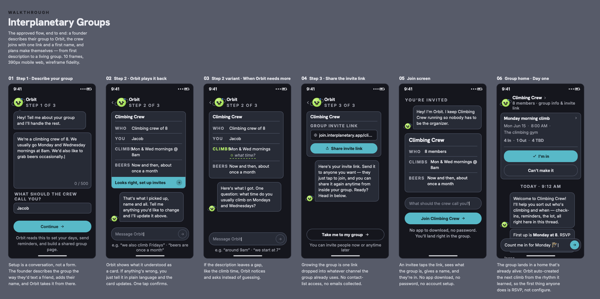
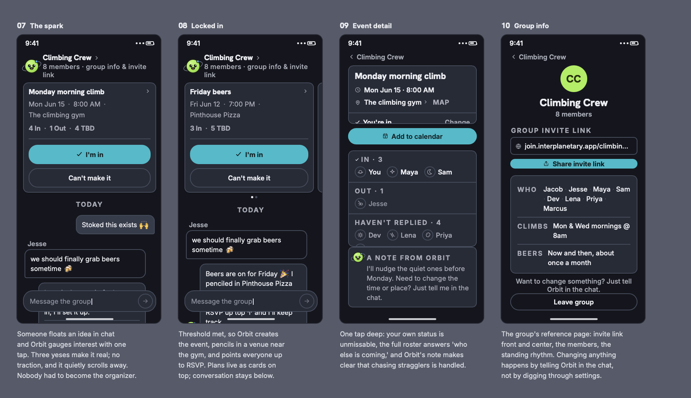

# Interplanetary Groups: the one-shot experiment

**What happens when you hand a fully specified product to a coding agent and tell it to build the rest in one pass?**

It got about 90% of the way there in two days. Everything it got wrong was at a seam.

> ### 📍 You are in the experiment repo
>
> There are two repos with this name. **This one is the experiment**, a side test of how far an agent gets on its own. It is finished as an experiment and is not being developed further.
>
> **The real product lives at [jacobrios/interplanetary-groups](https://github.com/jacobrios/interplanetary-groups)**, built the slow way, one reviewed slice at a time. If you want to see how I actually work, go there. If you want to see what I learned about working with agents, stay here.

---

## What the app is

Casual groups pick between two bad options. Low-effort coordination ("show up if you want") means nobody shows up. High-effort coordination (polls, forms, a group text with forty replies) feels like planning a wedding for a casual Sunday. Both fail for the same reason: someone always has to be the organizer, and that person burns out or never volunteers in the first place.

Interplanetary Groups hands that job to an AI coordinator named Orbit. A founder describes their group the way they'd text a friend ("we're a climbing crew of 8, we go Mon and Wed mornings at 8"). Orbit pulls out the rhythm, plays back what it understood, asks about anything genuinely missing, and creates the group with its first event already on the calendar. One link joins people to the group, never to a single event. When someone floats an idea in chat, Orbit gauges interest with one-tap responses and creates the event once enough people are in. The organizer role dissolves.

The full product thinking lives in the other repo. This README is about the build, not the product.

---

## The setup

I gave the agent a deliberately unfair advantage, because that was the point of the test. I wanted to know what the ceiling looks like when the spec is genuinely good, not when it's vague.

**What it started with:**

- A snapshot of the real repo, already built and reviewed by hand through the data model, events, RSVPs, group chat, and the recurring-event job
- `CLAUDE.md`, ~15,000 characters of standing product rules: north stars, Orbit's behavioral guardrails, the color and type system, the load-bearing data model constraints
- `docs/build-notes.md`, ~69,000 characters of decision history explaining the why behind all of it
- Ten annotated screen mockups covering the exact flows it was asked to build
- Safety nets already wired: a hook that runs the test suite after every file edit, and a hook that blocks edits to applied migrations and env files

**What it built, unattended, in essentially one pass** ([commit `eb6fa31`](https://github.com/jacobrios/interplanetary-groups-oneshot/commit/eb6fa31)):

The three-step onboarding wizard, the Orbit extraction layer that turns free text into a structured schedule, the invite and join flow, the spark and gauge flow (idea in chat becomes a real event), a timezone display fix, a Prisma migration, and a visual pass against the mockups.

**The mockups it was working from:**





---

## What actually happened

All ten screens got built. The code typechecks. It reads like code a person wrote. If you had shown me the diff without telling me where it came from, I would not have guessed.

Then four things broke, and three of them broke in the same place: not inside a screen, not inside a function, but at the **seams**. The joins. Where one piece hands off to another, and where a written rule made the flow harder on purpose instead of describing something visible.

**1. It routed around a rule that made the product harder to use.**

`CLAUDE.md` says, as a hard guardrail: *ask if missing, don't guess.* If a founder's description leaves out the meeting time, Orbit is supposed to stop and ask, because a group with no rhythm gets no events on day one, which is the entire value of the product.

The agent built the clarifying question correctly. Then it also built a "Skip for now" button next to it, and a code path that advanced the wizard whether or not the question got answered. Both are perfectly reasonable UX instincts in isolation. Both quietly destroy the guardrail.

This is the failure I think about most. The rule was in the spec, in plain language, marked as non-negotiable. The agent read it, implemented it, and then built an escape hatch around it, because escape hatches are what a well-trained model has seen a thousand times in onboarding flows. A stated rule is not a constraint. Only a gate is a constraint.

**2. It built both pieces and not the handoff.**

Group creation saves the group's rhythm. A separate job reads that rhythm and creates the next event. Both worked. Nothing called the second one at the moment the first one finished, because the only existing caller was a daily cron job.

Result: you complete onboarding, land on your brand new group home, and it says "No upcoming events yet." Every part passed its own test. The product was broken anyway. Local dev never runs the cron, so the failure was invisible until a human clicked through the flow like a real user.

**3. It could not close the loop on anything it could not see.**

Sending a chat message appeared to do nothing. The agent investigated it thoroughly and honestly: it proved the data layer worked, proved the auth layer worked, audited the whole path, added error logging, and then wrote down that it could not verify the actual browser behavior and named the most likely cause. That entry is still open in the decision log.

I count this as the correct behavior, not a failure. It's the shape of the limit that matters: an agent can reason to the edge of what it can observe and then it has to stop. Anything that only reproduces in a browser needs a human, or a tool the agent can actually drive.

**4. Model output got treated as fact.**

The extraction step reported a field as "missing" that the schema never required in the first place, which would have sent Orbit to ask a founder a clarifying question about something the product had no reason to know. Fixed by normalizing every extraction against the schema before anything branches on it.

This one is not really an agent failure, it's an LLM product failure, and it's the single most transferable lesson here. Model output is a claim, not a fact. It needs one place where it gets validated and normalized before any user-facing behavior keys off it.

---

## What I changed because of this

- **Hard rules need a gate, not a sentence.** If a constraint matters, something has to fail when it's violated: a test, a type, a hook. Writing "this is non-negotiable" in a spec buys you nothing.
- **Review at the seams, not at the diff.** Reading the code line by line would not have caught any of the first three. Clicking through the flow like a user caught all of them in minutes.
- **Slices, for a reason I did not expect.** I already built the real repo in small reviewed slices. I assumed the benefit was quality control. The actual benefit is that a slice boundary is a seam you're forced to look at, out loud, before you cross it.
- **One normalization boundary for model output.** The real repo now has exactly one, and nothing branches on a raw model response.
- **The spec was the real work.** The agent's output was only as good as the 69,000 characters of decision history it was standing on. The part that took months was writing down why, and that turned out to be the part that made the two-day build possible. That's a product job, not an engineering one.

---

## Where the thinking lives

- **[DECISIONS.md](DECISIONS.md)** is the most interesting file in this repo. The agent was told to keep a live decision log, and it did: 26 entries, each with the alternative it rejected, a one-line why, and an honest tag for how much thought it got ("quick default" vs. "considered call"). The bug write-ups at the bottom are where the seam failures got diagnosed in real time.
- **[CLAUDE.md](CLAUDE.md)** is the spec the agent was handed. Product north stars, Orbit's behavioral guardrails, the color and type system, and the data model rules that were not allowed to bend.
- **[docs/build-notes.md](docs/build-notes.md)** is the inherited decision record from the real repo, the why behind every product call.

---

## Honest state of this repo

This is an archived experiment, not a maintained project. As of today:

| | |
|---|---|
| `npx tsc --noEmit` | Clean |
| `npm run lint` | 0 errors, 9 warnings (unused vars in test helpers) |
| `npm test` | 92 passing, 5 failing against the database it was last pointed at |

**Why those 5 fail, and what it does not tell you.** They are environment, not code. The tests here are integration tests that hit a real database, and this experiment was still pointed at the same Supabase project as the active repo. That database moved on: the migration this experiment generated was never applied there, and three later migrations from the real project exist there but not here, so five tests hit a column that does not exist. Applying this repo's migration would have mutated the other project's database, so it stayed unapplied and those five stayed red.

Against a correctly migrated database they would likely all pass, but **I did not verify that**, so treat the 92 as the number I actually observed rather than the number the code deserves. The environment file has since been removed from this archived repo, so reproducing either result means supplying your own database first.

The real lesson is the one underneath: integration tests pointed at a shared live database are not portable, and a repo forked from another project inherits that coupling silently.

**Two things I fixed while writing this README**, both pre-dating the one-shot and inherited from the snapshot: two lint errors (unescaped apostrophes in JSX), and a test that hardcoded a "future" date of 25 Jul 2026 and started failing on its own when the calendar passed it. It now uses offsets from the current time. That one is a good reminder that a passing test is only evidence if it could have failed, and a test with a calendar date baked in has an expiration date on it.

**The chat send bug** documented in DECISIONS.md was never browser-verified and is still open.

---

## Running it locally

```bash
npm install
npx prisma generate
npm run dev
```

Needs a `.env` with:

| Variable | What it's for |
|---|---|
| `DATABASE_URL` | Runtime connection, used by the Prisma driver adapter |
| `DIRECT_URL` | Migrations. The Prisma CLI reads this one, not `DATABASE_URL` (see `prisma.config.ts`). Both can point at the same database. |
| `NEXT_PUBLIC_SUPABASE_URL` | Supabase auth |
| `NEXT_PUBLIC_SUPABASE_PUBLISHABLE_KEY` | Supabase auth |
| `ANTHROPIC_API_KEY` | Orbit's extraction and chat copy |
| `CRON_SECRET` | Production only. The daily cron endpoint enforces it when set, and skips the check outside production. |

Point both URLs at your own empty Postgres and run `npx prisma migrate deploy` before the app or the tests will work.

> **⚠️ Do not run `prisma migrate dev` or `prisma migrate reset` in this repo without checking where `DATABASE_URL` points first.** The tests here are integration tests that hit a real database, and this archived experiment's migration history has drifted from the active project it was forked from. Run against a database you are willing to lose.

```bash
npm test
npm run lint
```

**Stack:** Next.js 16, React 19, Tailwind 4, Postgres via Prisma 7, Supabase for auth only, Claude via the Anthropic SDK for extraction and Orbit's copy, Vitest, Vercel.
